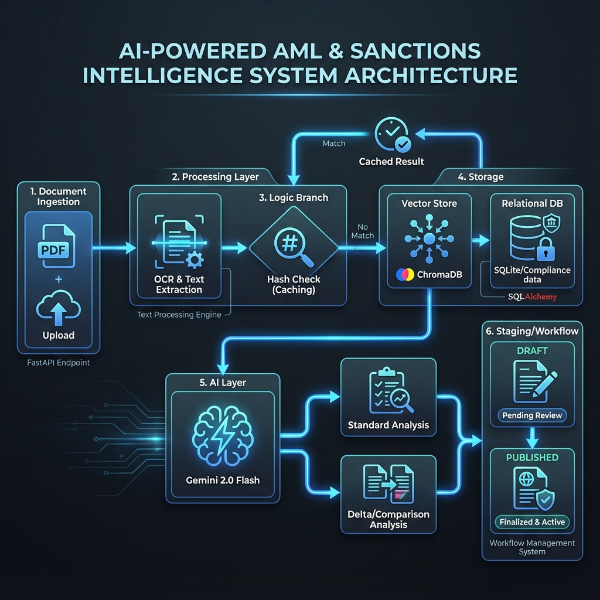
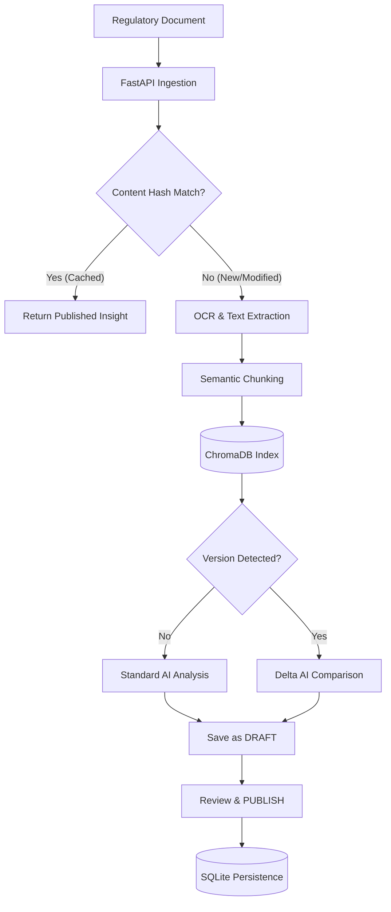

# AI-Powered AML and Sanctions Intelligence System

An enterprise-grade AI system designed to ingest, analyze, and surface compliance insights from regulatory and sanctions documents. The system applies OCR, RAG, and LLM-based semantic analysis to provide decision-support for financial crime compliance.

## Core Capabilities
- **Automated Ingestion**: Extracts text from regulatory PDFs and scanned documents using PyPDF and Tesseract.
- **Semantic Retrieval (RAG)**: Indexes document chunks using `ChromaDB` and `sentence-transformers` for context-aware querying.
- **Intelligent Caching**: Hash-based content detection skips redundant AI processing for identical documents.
- **Auto-Compare & Delta Analysis**: Automatically detects new versions of existing documents and generates comparison reports highlighting added/removed entities and risk shifts.
- **AI-Powered Risk Analysis**: Extracts entities (Sanctioned parties, High-risk countries) and generates structured risk summaries with grounding using Gemini 2.0.
- **Versioning & Staging**: Supports a 'DRAFT' to 'PUBLISHED' lifecycle for compliance insights, ensuring human-in-the-loop validation.
- **Auditability**: Centralized persistence of all analysis results and actions in a SQLite/PostgreSQL-compatible schema.

## Technical Stack
- **API**: FastAPI
- **LLM**: Gemini (Google) - Primary engine for analysis and comparison.
- **Vector DB**: ChromaDB
- **Database**: SQLAlchemy (SQLite for MVP, PostgreSQL ready)
- **OCR**: Tesseract & PyPDF
- **Embeddings**: `all-MiniLM-L6-v2` (Sentence Transformers)

## Application Flow
The system processes regulatory documents through a multi-stage AI pipeline:

1.  **Ingestion & Hashing**: Documents are uploaded; a unique SHA-256 hash is generated to identify the content.
2.  **Caching Check**: If the hash matches an existing document with a published insight, the system returns the cached result.
3.  **OCR & Extraction**: New content is processed using PyPDF or Tesseract OCR fallback.
4.  **Semantic Chunking & Indexing**: Text is split into contextual chunks and indexed in `ChromaDB`.
5.  **Auto-Compare Logic**: If the filename matches an existing record but the hash differs, the system triggers a **Delta Analysis** against the previous version.
6.  **RAG-Enhanced Analysis**: For new documents, the LLM performs a standard compliance analysis grounded by retrieved context.
7.  **Versioning/Staging**: Results are saved as a 'DRAFT' in the database (`compliance.db`) for review before being 'PUBLISHED'.

### System Workflow (Mermaid)

## Project Structure
- `src/api/`: FastAPI endpoints and route handlers.
- `src/ai/`: LLM abstraction, compliance prompts, and structured output models (Pydantic).
- `src/ingestion/`: Document loading, OCR fallback, and hashing logic.
- `src/retrieval/`: Vector store management and semantic search logic.
- `src/core/`: End-to-End pipeline orchestration and business logic.
- `src/db/`: SQLAlchemy models (Document, Chunk, Insight) and session handling.
- `src/utils/`: Standardized logging and configuration helpers.

## API Endpoints
- `POST /v1/ingest`: Upload document. Returns `document_id`. Handles caching and delta triggers.
- `GET /v1/documents`: List all ingested documents and metadata.
- `GET /v1/analysis/{document_id}`: Retrieve the structured compliance risk summary or comparison.
- `POST /v1/analysis/{document_id}/publish`: Transition an insight from 'DRAFT' to 'PUBLISHED'.

## Setup & Execution

1.  **Dependencies**: `pip install -r requirements.txt`
2.  **Configuration**: 
    - Create a `.env` file from `.env.example`.
    - Add your `GOOGLE_API_KEY`.
3.  **Run Server**: `python main.py`
4.  **Verify**: 
    - Full API test: `python tests/verify_api.py`
    - Versioning/Caching test: `python tests/verify_versioning.py`

### Development & Mock Mode
The system includes a **Mock Mode** to allow development and testing without making actual LLM API calls. This is useful for UI development, pipeline testing, or when hitting API quota limits.

To enable Mock Mode:
1. Open `config.yaml`.
2. Set `mock_mode: true` under the `llm` section.
3. Restart the server.

When enabled, the LLM will return predefined mock responses for compliance analysis and comparisons.

## Audit & Persistence
- **Database**: `compliance.db` (SQLite)
- **Logs**: `workflow.log` (Centralized audit trail)
