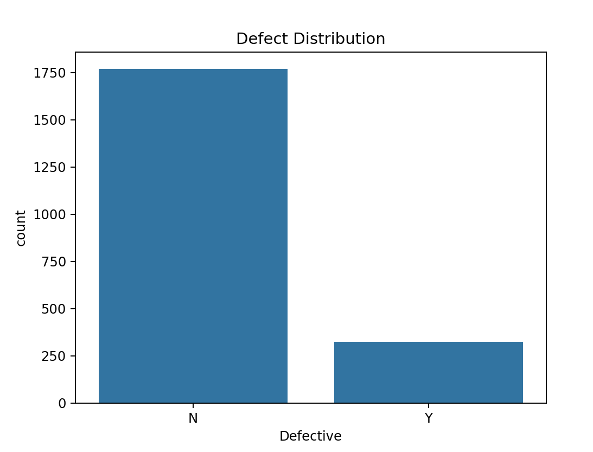
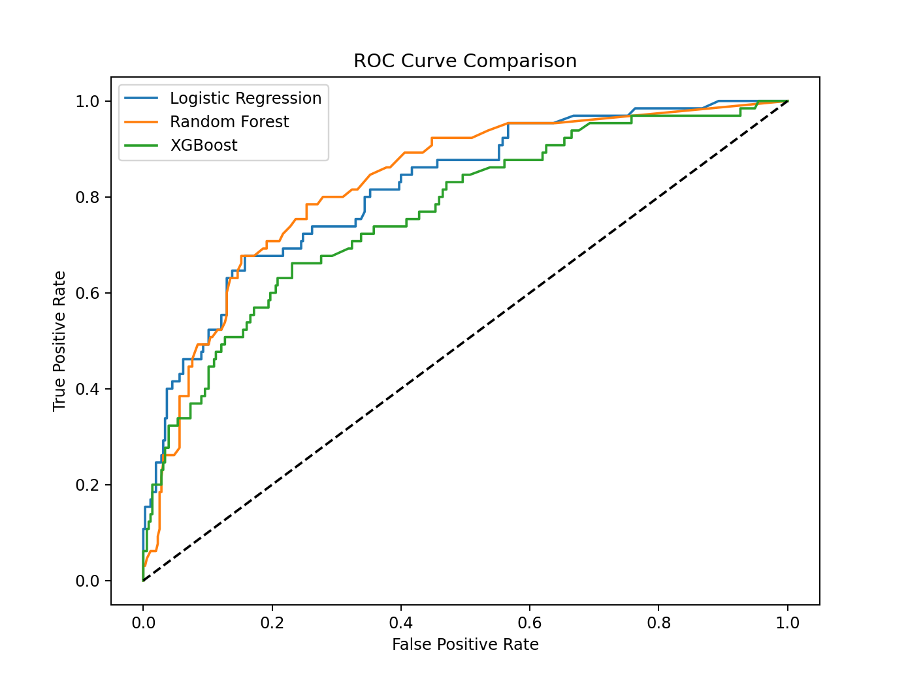
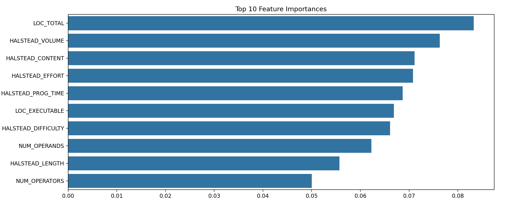

# Software Defect Prediction using Machine Learning

## Project Overview
This project applies **machine learning techniques** to predict software defects using the **NASA Metrics Data Program (MDP)** dataset.  
The goal is to automatically identify potentially defective software modules from measurable code metrics — helping developers prioritize testing and maintenance efforts more efficiently.

---

## Problem Statement
Software defects are a critical issue in large-scale systems, causing failures, cost overruns, and reliability risks.  
Manual reviews are slow and error-prone. This project automates the process using ML models that learn patterns from historical code metrics to:
- Detect modules with a higher likelihood of defects  
- Reduce manual review overhead  
- Improve software quality and reliability

## Project Structure
```
Defect Prediction/
├── data/
│   └── defect_data.csv      # NASA MDP dataset
├── src/
│   ├── DataHandler.py       # Data loading and preprocessing
│   ├── ModelManager.py      # ML model management
│   ├── Evaluator.py        # Model evaluation
│   ├── Visualizer.py       # Visualization utilities
│   └── MainPipeline.py     # Main execution pipeline
├── requirements.txt         # Project dependencies
└── README.md               # Project documentation
```

## Dataset Description
The NASA MDP dataset contains software metrics and defect data from various software projects. Each row represents a software module with:

### Features
- **Size Metrics**: LOC_BLANK, LOC_CODE_AND_COMMENT, LOC_COMMENTS, LOC_EXECUTABLE, LOC_TOTAL
- **Complexity Metrics**: CYCLOMATIC_COMPLEXITY, ESSENTIAL_COMPLEXITY, DESIGN_COMPLEXITY
- **Halstead Metrics**: CONTENT, DIFFICULTY, EFFORT, ERROR_EST, LENGTH, LEVEL, PROG_TIME, VOLUME
- **Symbol Metrics**: NUM_OPERANDS, NUM_OPERATORS, NUM_UNIQUE_OPERANDS, NUM_UNIQUE_OPERATORS
- **Target Variable**: DEFECTIVE (Y/N)

### Dataset Statistics
- Total Instances: 2,096
- Features: 21
- Class Distribution:
  - Non-defective (N): 84.49%
  - Defective (Y): 15.51%
- No missing values


## Methodology

### 1. Data Preprocessing
- Data loading and validation
- Exploratory Data Analysis (EDA)
- Feature scaling using StandardScaler
- Train-test split (80-20) with stratification

### 2. Model Selection
Three different models were chosen for comparison:
1. **Logistic Regression**: Baseline linear model
2. **Random Forest**: Ensemble learning with decision trees
3. **XGBoost**: Gradient boosting for high performance

### 3. Implementation Details
The project follows Object-Oriented Programming principles with separate classes for:
- Data handling (`DataHandler`)
- Model management (`ModelManager`)
- Evaluation (`Evaluator`)
- Visualization (`Visualizer`)

## Results

### Model Performance

| Model               | Accuracy | F1-score | ROC AUC |
|--------------------|----------|----------|---------|
| Logistic Regression| 0.8643   | 0.3448   | 0.6055  |
| Random Forest      | 0.8595   | 0.3656   | 0.6153  |
| XGBoost            | 0.8595   | 0.4040   | 0.6341  |

### Key Findings
1. All models achieve similar accuracy (~86%)
2. XGBoost shows the best F1-score and ROC AUC
3. Models show good precision but lower recall for defective class
4. Imbalanced dataset affects model performance on minority class


### Model Performance Analysis
```
XGBoost Performance:
               precision    recall  f1-score   support
Non-defective     0.88      0.96      0.92       355
Defective         0.59      0.31      0.40        65
```
### **Feature Importance**  
The most influential metrics identified were **`LOC_TOTAL`**, **`HALSTEAD_VOLUME`**, **`HALSTEAD_EFFORT`**, and **`HALSTEAD_DIFFICULTY`**.  
These features capture key aspects of **module size**, **code complexity**, and **developer effort**, all of which strongly correlate with the likelihood of software defects.  
In simpler terms, larger and more complex modules tend to have higher defect rates — confirming that structural and cognitive complexity are strong indicators of software quality.

**Feature Abbreviations Explained:**
- **`LOC_TOTAL`** – *Lines of Code (Total)*: the total number of lines in a module, including code and comments.  
- **`HALSTEAD_VOLUME`** – measures the *size* of the implementation based on unique operators and operands.  
- **`HALSTEAD_EFFORT`** – estimates the *mental effort* required to develop or maintain the code.  
- **`HALSTEAD_DIFFICULTY`** – quantifies how *hard* the code is to understand or modify; higher values mean higher cognitive load.  
- **`CYCLOMATIC_COMPLEXITY`** – counts the number of independent paths through the code (control-flow complexity).  


## Project Highlights

### Technical Skills Demonstrated
1. **Machine Learning**
   - Model selection and evaluation
   - Handling imbalanced datasets
   - Feature scaling and preprocessing

2. **Software Engineering**
   - Object-Oriented Programming
   - Clean code architecture
   - Modular design

3. **Data Analysis**
   - Exploratory Data Analysis
   - Statistical analysis
   - Performance metrics interpretation

### Best Practices
- Documented code with clear docstrings
- Modular and maintainable architecture
- Comprehensive error handling
- Performance optimization

## Future Improvements
1. Implement advanced sampling techniques (SMOTE, ADASYN)
2. Add cross-validation for more robust evaluation
3. Explore deep learning approaches
4. Implement feature selection techniques
5. Add model interpretability analysis

## Installation and Usage

### Prerequisites
```bash
python 3.x
pip install -r requirements.txt
```

### Running the Project
```bash
python src/MainPipeline.py
```

## Author
Acyuth Kumar Baddela

## Acknowledgments
- NASA Metrics Data Program for the dataset
- scikit-learn, XGBoost, and other open-source libraries

## License
MIT License
