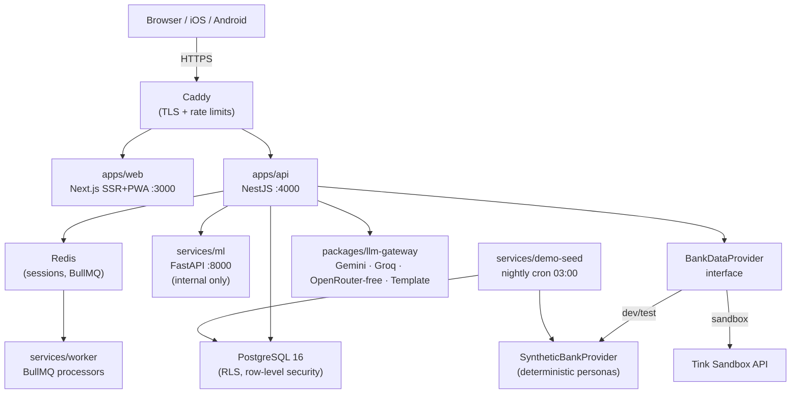
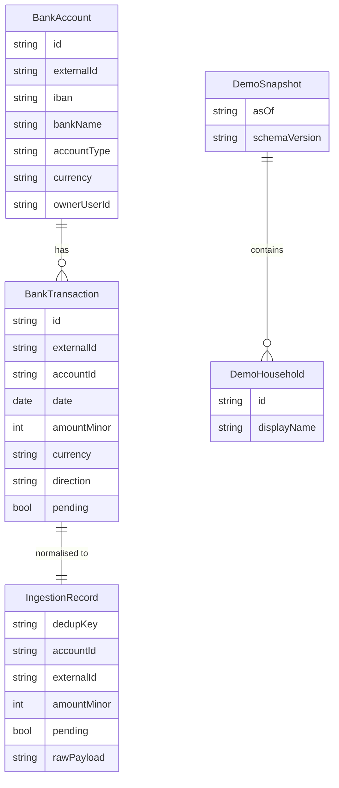

# SubTrack

SubTrack shows a Swedish household every subscription it pays for — across every bank account — who pays, what it's trending towards, and whether a cheaper plan exists.

## What it does

- **Finds subscriptions automatically** — connects to bank accounts via Open Banking, ingests transactions, and uses ML classifiers to detect recurring subscription payments without the user manually entering anything.
- **Works across a whole household** — members link their own bank accounts; SubTrack stitches together the full picture while respecting each member's privacy settings.
- **Detects price creep** — tracks amount changes over time, flags when a subscription silently increased, and surfaces cheaper plan alternatives from the merchant catalog.
- **Splits fairly** — calculates each member's share of shared subscriptions and shows who owes whom each month.

## Architecture overview



## Monorepo layout

| Path | Description |
|---|---|
| `apps/web` | Next.js App Router, RSC, PWA, next-intl, TanStack Query, Framer Motion |
| `apps/api` | NestJS + Prisma + OpenAPI — the single API for all clients |
| `apps/mobile` | Expo / React Native, Expo Router, Reanimated, expo-secure-store |
| `services/ml` | Python 3.12 FastAPI — subscription classifiers, clustering, forecasting |
| `services/worker` | BullMQ processors for bank sync, detection, scraping, notifications |
| `services/demo-seed` | Nightly cron that reseeds demo tenant data from deterministic personas |
| `packages/domain` | Pure TS — bank types, ingestion worker, merchant matching, policy engine |
| `packages/synthetic` | Deterministic fake bank data — `SyntheticBankProvider` + 5 persona households |
| `packages/catalog` | 62 Swedish-market merchants + 124 plans as YAML, with TypeScript loader |
| `packages/llm-gateway` | LLM provider abstraction — Gemini, Groq, OpenRouter (free-only), Template |
| `packages/money` | Pure TS — minor-unit arithmetic, allocation (largest-remainder), settlement netting |
| `packages/contracts` | `openapi.yaml` → generated TS client + zod schemas |
| `packages/ui` | Web React components + Storybook |
| `packages/ui-tokens` | Norrsken design tokens (JSON → CSS vars + React Native theme) |
| `packages/i18n` | `sv.json` + `en.json` translations + parity checker |
| `packages/config` | Shared ESLint, TypeScript, and Prettier presets |

## AI capabilities

### LLM Gateway (`packages/llm-gateway`)

A provider-agnostic gateway that normalises requests across four LLM backends with shared caching and rate limiting. Prevents a single provider outage from breaking AI-powered features.

| Provider | Purpose | Cost constraint |
|---|---|---|
| **Gemini** | Primary — high quality, generous free tier | API key required |
| **Groq** | Speed fallback — ultra-low latency inference | API key required |
| **OpenRouter** | Breadth — access to many open models | **`:free` suffix enforced in code** — paid models throw at runtime |
| **Template** | Zero-latency static responses for tests | None |

Built-in guardrails:
- **LRU cache** — SHA-256 key over `{provider, model, messages, temperature, maxTokens}`, 256-entry capacity, 5-minute TTL.
- **Token-bucket rate limiter** — per-provider, configurable `requestsPerMinute`.
- **Numeric post-check** — scans LLM output for `NaN`, `Infinity`, `-Infinity`, `undefined`, `null`, numbers > 10¹², and integers ≥ 16 digits.

### Subscription Classifier (`services/ml` — `POST /ml/v1/classify`)

Detects whether a bank transaction description is a subscription payment.

- **Stage 1 (rule-based):** normalised description matched against every alias in `packages/catalog/data/merchants.yaml`. Match → `is_subscription=true, confidence=0.95`.
- **Stage 2 (ML fallback):** TF-IDF char n-grams (3–5), max 5 000 features, Logistic Regression (C=5). Trained on ~300 catalog aliases plus 24 synthetic non-subscription negatives.

### Category Classifier (`services/ml` — `POST /ml/v1/classify`)

Predicts the subscription category for a matched transaction.

- **13 categories:** `VIDEO_STREAMING`, `MUSIC_AUDIO`, `SOFTWARE_PRODUCTIVITY`, `CLOUD_STORAGE`, `AUDIOBOOKS_EBOOKS`, `GAMING`, `FITNESS_WELLNESS`, `EDUCATION_KIDS`, `NEWS_MAGAZINES`, `AI_TOOLS`, `VPN_SECURITY`, `APP_STORE_BILLING`, `OTHER_SUBSCRIPTION`.
- TF-IDF char n-grams (3–5), max 8 000 features, Logistic Regression. Returns `{category, confidence, top3}`.

### Descriptor Clustering (`services/ml` — `POST /ml/v1/cluster/descriptors`)

Groups bank-statement descriptor variants of the same merchant — e.g. `NETFLIX.COM`, `NETFLIX*`, `Netflix AB` → one cluster. Feeds the merchant normaliser to avoid the same subscription appearing as multiple merchants.

- TF-IDF char n-grams → cosine-distance matrix → DBSCAN (configurable `eps`, default 0.3).

### Cohort Clustering (`services/ml` — `POST /ml/v1/cluster/households`)

Groups households by subscription profile for personalised recommendations.

- Feature vector: 13-dimensional category count + normalised monthly spend.
- K-means (configurable k, default 3) with StandardScaler.

### Synthetic Bank Data (`packages/synthetic`)

`SyntheticBankProvider` implements `BankDataProvider` and generates deterministic fake transactions for dev and test — no real bank credentials needed. Seeded with SFC32 PRNG from `(householdSeed + month)`, guaranteeing reproducible data across runs.

### Demo Seed Generator (`services/demo-seed`)

`generateDemoSnapshot(asOfDate)` produces a complete `DemoSnapshot` covering 5 persona households, a 13-month rolling transaction window, and schema version metadata. Runs nightly at 03:00 via Docker Compose (`com.subtrack.cron=0 3 * * *`).

## ML service endpoints

| Method | Path | Description | Key inputs | Key outputs |
|---|---|---|---|---|
| `GET` | `/healthz` | Liveness probe | — | `{status: "ok"}` |
| `GET` | `/ml/v1/models` | List loaded models | — | `{models: [...]}` |
| `POST` | `/ml/v1/classify` | Subscription + category classification | `{description, amount_minor?}` | `{subscription: {is_subscription, confidence, matched_alias}, category: {category, confidence, top3}}` |
| `POST` | `/ml/v1/cluster/descriptors` | Cluster descriptor variants | `{descriptions: string[], eps?, min_samples?}` | `{clusters: [{cluster_id, members, centroid_text, size}]}` |
| `POST` | `/ml/v1/cluster/households` | Cohort clustering | `[{household_id, subscriptions: [{category, amount_minor, billing_cadence}]}]` | `{cohorts: [{cohort_id, household_ids, dominant_categories, avg_monthly_spend}]}` |

## Design prototype

An interactive HTML prototype of the full UI is at [`docs/subtrack-prototype.html`](docs/subtrack-prototype.html). Open it directly in any browser — no server needed.

It covers all 5 screens (Hem, Prenumerationer, Hushåll, Insikter, Profil) with a live orbit animation, subscription detail drawer, and a ☀️/🌙 toggle for dark ("Polarnatt") and light ("Snö") modes. Based on the [Norrsken design direction](docs/product/DESIGN_DIRECTION.md).

## Quick start

```bash
cd SubTrack
make up          # starts postgres, redis, mailpit, caddy, ml via Docker Compose
pnpm install
pnpm test        # lint + typecheck + vitest + storybook visual + ML pytest + gitleaks
```

## Running the ML service locally

```bash
cd services/ml
uv sync
uv run uvicorn app.main:app --reload --port 8000
```

## Tech stack

| Layer | Technology | Why |
|---|---|---|
| Web frontend | Next.js 15 (App Router, RSC, PWA) | SEO + fast first load; installable on mobile |
| Mobile | Expo / React Native | Single codebase for iOS + Android |
| API | NestJS + TypeScript | Structured DI, decorator-based OpenAPI, Prisma integration |
| Database | PostgreSQL 16 with RLS | Row-level security for household privacy model |
| Queue | BullMQ + Redis | Async bank sync, detection, scraping jobs |
| ML service | Python 3.12 + FastAPI + scikit-learn | Standard ML tooling; isolated from money arithmetic |
| LLM layer | `packages/llm-gateway` | Provider-agnostic, cached, rate-limited, with numeric guardrails |
| Design tokens | Norrsken (OKLCH) | Perceptually uniform colour system; accessible contrast |
| Monorepo | pnpm + Turborepo | Incremental builds, workspace dependency graph |
| CI | GitHub Actions + auto-merge | `st/*` branches merge automatically after quality gates pass |

## Data model highlights



## Personas & demo data

Five deterministic showcase households are defined in `packages/synthetic/src/personas.ts`. Each has ground-truth subscription labels used for ML evaluation (ST-080) and app demos.

| Persona | Profile | Subscriptions | Monthly cost (SEK) |
|---|---|---|---|
| Emma Solberg | Single professional | 4 (Netflix, Spotify, iCloud, LinkedIn Premium annual) | ~382 |
| Lars & Maria Lindqvist | Couple | 6 (Disney+, YouTube Premium, Spotify Duo, Storytel, Microsoft 365 annual, iCloud 2TB) | ~796 |
| Ahmadi Family | Family (4 members) | 8 (Netflix, Spotify Family, Max, Adobe CC, YouTube, Duolingo, Headspace, Apple One) | ~1,966 |
| Jakob Eriksson | Student | 3 (Spotify Student, Netflix, GitHub Copilot) | ~327 |
| Adaeze Okonkwo | Freelance designer | 5 (Adobe CC, Figma, Notion, Slack, Vercel) | ~1,546 |

`generateDemoSnapshot(asOfDate)` produces a 13-month rolling window of transactions for all five households. The SFC32 PRNG is seeded per-household so the same `asOfDate` always produces the same data — critical for deterministic tests and CI.

## Development

**Branch convention:** `st/ST-NNN-short-description` — matches tasks in `.sdlc/tasks/ST-NNN.md`.

**CI pipeline** (GitHub Actions, `.github/workflows/subtrack-ci.yml`):
1. Lint (`pnpm lint`)
2. Typecheck (`pnpm typecheck`)
3. Unit + integration tests (`pnpm test`)
4. Token contrast check (WCAG AA, OKLCH pairs)
5. Storybook build + visual regression (Playwright, 1% threshold)
6. ML service tests (`uv run pytest`)
7. i18n catalog parity
8. Gitleaks secret scan
9. License allowlist check (SPDX)

**Auto-merge:** PRs on `st/*` branches merge automatically (squash) after CI passes, via `.github/workflows/auto-merge.yml`.

See [`docs/`](docs/) for full architecture, AI skills reference, and persona details.
