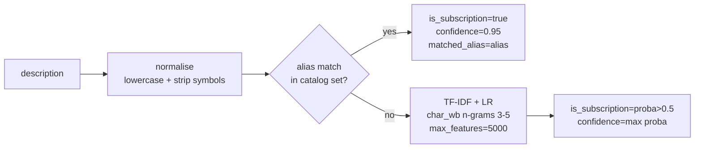
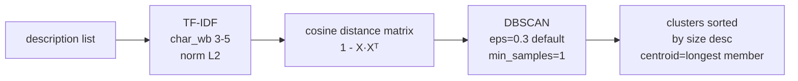

# SubTrack AI Skills Reference

All AI-powered capabilities in the SubTrack monorepo — where they live, how they work, and how to use them.

---

## LLM Gateway (`packages/llm-gateway`)

### Purpose

The gateway provides a single TypeScript interface for calling any of four LLM providers with built-in caching, rate limiting, and numeric safety checks. Application code imports `LlmGateway` and never calls provider SDKs directly — this makes it trivial to swap providers, add fallback logic, or mock in tests.

### Providers

| Provider | Class | Model examples | Notes |
|---|---|---|---|
| `gemini` | `GeminiProvider` | `gemini-2.0-flash`, `gemini-1.5-pro` | Requires `GEMINI_API_KEY` |
| `groq` | `GroqProvider` | `llama-3.1-8b-instant`, `mixtral-8x7b-32768` | Requires `GROQ_API_KEY`; ultra-low latency |
| `openrouter` | `OpenRouterProvider` | `meta-llama/llama-3.1-8b-instruct:free`, `mistralai/mistral-7b-instruct:free` | Requires `OPENROUTER_API_KEY`; **`:free` suffix mandatory** |
| `template` | `TemplateProvider` | *(any string)* | No API call; returns a static configurable response — for tests |

### OpenRouter `:free` enforcement

The `OpenRouterProvider` **throws at runtime** if a non-free model is passed:

```
OpenRouterProvider: only ":free" suffix models are allowed. Got: "meta-llama/llama-3.1-8b-instruct".
Use a model like "meta-llama/llama-3.1-8b-instruct:free".
```

This is enforced in code (`packages/llm-gateway/src/providers/openrouter.ts:12-17`) — no environment variable can override it. This keeps the bill at zero for all OpenRouter usage.

### LRU Cache

```
Key = SHA-256( JSON{ provider, model, messages, temperature, maxTokens } ).slice(0,32)
```

- Default capacity: **256 entries** (configurable via `CacheConfig.maxSize`)
- Default TTL: **5 minutes** (configurable via `CacheConfig.ttlMs`)
- Eviction: LRU (oldest entry removed when capacity reached)
- Bypass: set `request.bypassCache = true` to skip cache read (result is still written)
- Hit response: `latencyMs = 0`, `cached = true`

### Token-bucket rate limiter

- One bucket per provider, refills at `requestsPerMinute / 60` tokens/second
- Default: unlimited (no limit set unless `rateLimits` passed to config)
- On exhaustion: throws `Rate limit exceeded for provider: <name>`

### Numeric post-check

`checkNumericOutput(text, { maxAbsValue? })` scans LLM response text for financial data corruption:

| Pattern | Flagged as |
|---|---|
| `NaN`, `Infinity`, `-Infinity` | Suspicious keyword |
| `undefined`, `null` | Suspicious keyword |
| Any number > 10¹² (default) | Suspiciously large |
| Integer ≥ 16 digits | Suspiciously long |

Returns `{ passed: boolean, foundNumbers: number[], warnings: string[] }`. Application code decides whether to retry or surface an error.

### Usage example

```typescript
import { LlmGateway } from '@subtrack/llm-gateway';

const gateway = new LlmGateway({
  geminiApiKey: process.env.GEMINI_API_KEY,
  groqApiKey: process.env.GROQ_API_KEY,
  openrouterApiKey: process.env.OPENROUTER_API_KEY,
  cache: { maxSize: 512, ttlMs: 10 * 60 * 1000 },
  rateLimits: { groq: { requestsPerMinute: 30 } },
});

const response = await gateway.complete({
  provider: 'gemini',
  model: 'gemini-2.0-flash',
  messages: [
    { role: 'system', content: 'You are a subscription price analyst.' },
    { role: 'user', content: 'Is 149 SEK/month for Netflix expensive in Sweden?' },
  ],
  temperature: 0.2,
  maxTokens: 256,
});

console.log(response.content);   // the text
console.log(response.cached);    // true if served from cache
console.log(response.latencyMs); // 0 on cache hit
```

---

## Subscription Classifier

**Location:** `services/ml/app/classifiers/subscription.py`  
**Endpoint:** `POST /ml/v1/classify`

### Input / output

```json
// Request
{ "description": "NETFLIX.COM", "amount_minor": 14900 }

// Response
{
  "subscription": {
    "is_subscription": true,
    "confidence": 0.95,
    "matched_alias": "netflix.com"
  },
  "category": { ... }   // null when is_subscription = false
}
```

### How it works

Two-stage pipeline:



**Training data:**
- Positive: all aliases from `packages/catalog/data/merchants.yaml` (62 merchants, ~300 alias strings)
- Negative: 24 synthetic common Swedish bank transaction descriptors (ICA, COOP, SYSTEMBOLAGET, etc.)

---

## Category Classifier

**Location:** `services/ml/app/classifiers/category.py`  
**Endpoint:** `POST /ml/v1/classify` (runs after subscription detected)

### Input / output

```json
// Response fragment (inside classify response)
"category": {
  "category": "VIDEO_STREAMING",
  "confidence": 0.87,
  "top3": [["VIDEO_STREAMING", 0.87], ["MUSIC_AUDIO", 0.06], ["CLOUD_STORAGE", 0.03]]
}
```

### 13 categories

| ID | Examples |
|---|---|
| `VIDEO_STREAMING` | Netflix, Disney+, Max, Viaplay |
| `MUSIC_AUDIO` | Spotify, Apple Music, Tidal |
| `SOFTWARE_PRODUCTIVITY` | Adobe CC, Microsoft 365, Notion, Slack |
| `CLOUD_STORAGE` | iCloud, Google One, Dropbox |
| `AUDIOBOOKS_EBOOKS` | Storytel, BookBeat, Nextory |
| `GAMING` | Xbox Game Pass, PlayStation Plus, Steam |
| `FITNESS_WELLNESS` | Headspace, Calm, MyFitnessPal |
| `EDUCATION_KIDS` | Duolingo, Kahoot!, Kiwi |
| `NEWS_MAGAZINES` | Dagens Nyheter, Aftonbladet |
| `AI_TOOLS` | ChatGPT Plus, Midjourney, Cursor |
| `VPN_SECURITY` | NordVPN, ExpressVPN, 1Password |
| `APP_STORE_BILLING` | Apple App Store, Google Play |
| `OTHER_SUBSCRIPTION` | Catch-all |

**Model:** TF-IDF char_wb n-grams (3–5), max 8 000 features, Logistic Regression (C=5, max_iter=500).

---

## Descriptor Clustering

**Location:** `services/ml/app/clustering/descriptor.py`  
**Endpoint:** `POST /ml/v1/cluster/descriptors`

### Problem

A single Netflix subscription may appear in bank statements as `NETFLIX.COM`, `NETFLIX*`, `Netflix AB`, or `NETFLIX SE`. Without clustering, the normaliser treats these as four separate merchants. Descriptor clustering groups them before merchant matching.

### How it works



**Parameters:**
- `eps` (default `0.3`) — cosine distance threshold. Lower = stricter grouping.
- `min_samples` (default `1`) — every point is at least its own cluster (no noise label).

**Output:**
```json
{
  "clusters": [
    { "cluster_id": 0, "members": ["NETFLIX.COM","NETFLIX*","Netflix AB"], "centroid_text": "NETFLIX.COM", "size": 3 }
  ],
  "total_descriptions": 3,
  "num_clusters": 1
}
```

---

## Cohort Clustering

**Location:** `services/ml/app/clustering/cohort.py`  
**Endpoint:** `POST /ml/v1/cluster/households`

### Problem

To recommend "you might be overpaying — households like yours switched to a Family plan", SubTrack needs to group households by subscription profile. Cohort clustering provides that grouping.

### Feature vector

Each household is encoded as a 14-dimensional vector:

```
[ count(VIDEO_STREAMING), count(MUSIC_AUDIO), ..., count(OTHER_SUBSCRIPTION),  ← 13 dims
  total_monthly_spend_SEK / 100 ]                                               ← 1 dim
```

Monthly spend is normalised to `amount_minor / 12` for ANNUAL subscriptions.

**Model:** StandardScaler → K-means (`n_clusters=3` default, `random_state=42`, `n_init=10`).

**Output:**
```json
{
  "cohorts": [
    {
      "cohort_id": 0,
      "household_ids": ["household-solberg", "household-eriksson"],
      "dominant_categories": ["VIDEO_STREAMING", "MUSIC_AUDIO"],
      "avg_monthly_spend": 14250.0
    }
  ],
  "n_households": 5,
  "n_cohorts": 3
}
```

---

## Synthetic Bank Data (`packages/synthetic`)

### Purpose

`SyntheticBankProvider` implements `BankDataProvider` — the same interface that wraps the real Tink API — so tests and local development work without bank credentials.

### How determinism works

```
household seed string
        │
        ▼
  createRng(seed)   ←── SFC32 PRNG
        │
        ├── chargeDayOfMonth(seed, subId) = fnv1a32(seed+subId) % 28 + 1
        │        → stable billing day per subscription, 1–28
        │
        └── descriptorVariants[rng() % variants.length]
                 → picks one variant per transaction from the persona's list
```

The SFC32 PRNG is seeded once per household; the sequence is fully deterministic across machines and Node versions.

### Swedish business-day adjustment

Billing dates falling on weekends or public holidays are pushed to the next Swedish business day (`nextSwedishBusinessDay(date)`). This matches real bank behaviour for direct debit charges.

---

## Demo Seed Generator (`services/demo-seed`)

### `generateDemoSnapshot(asOfDate: Date): DemoSnapshot`

Produces a complete snapshot of all five persona households for the 13-month window ending at `asOfDate`.

```typescript
import { generateDemoSnapshot } from '@subtrack/demo-seed';

const snapshot = generateDemoSnapshot(new Date('2026-10-01'));
// snapshot.asOf          → "2026-10-01"
// snapshot.schemaVersion → "1.0.0"
// snapshot.households    → array of 5 DemoHousehold
// snapshot.households[0].transactions.length → ≥ 40 (Solberg, 4 monthly subs × 13 months)
```

### Schema version

`SCHEMA_VERSION = '1.0.0'` — included in every snapshot. Consumers should reject snapshots with an incompatible version.

### Nightly Docker Compose cron

`docker/demo-seed.yml` defines a service with label `com.subtrack.cron=0 3 * * *`. The cron runner picks this up and executes the seed at 03:00 nightly, writing the snapshot to the demo tenant's PostgreSQL.

---

## Ingestion Worker (`packages/domain/ingestion`)

### Purpose

The ingestion worker pulls transactions from `BankDataProvider`, deduplicates them, detects pending→booked transitions, and persists them via `IngestionStore`.

### Key types

```typescript
interface IngestionRecord {
  dedupKey: string;     // "${accountId}:${externalId}"
  accountId: string;
  amountMinor: number;  // signed: negative = debit
  pending: boolean;
  rawPayload: string;   // JSON of original BankTransaction
  // ... full fields in packages/domain/ingestion/types.ts
}
```

### `IngestionWorker`

```typescript
const worker = new IngestionWorker(bankProvider, store);

// Full backfill
const result = await worker.backfill(accountId, fromDate, toDate);
// result.inserted  → new records
// result.updated   → pending→booked transitions
// result.unchanged → count of unchanged records

// Incremental sync
const result = await worker.incrementalSync(accountId, since, toDate);
```

`InMemoryIngestionStore` is provided for tests. The Prisma-backed store will be added when the DB schema (ST-040) is complete.

### Deduplication logic

| Condition | Action |
|---|---|
| `dedupKey` not seen before | `inserted` |
| `dedupKey` seen, `pending` changed or `amountMinor` changed | `updated` |
| `dedupKey` seen, no changes | `unchanged` count++ |
