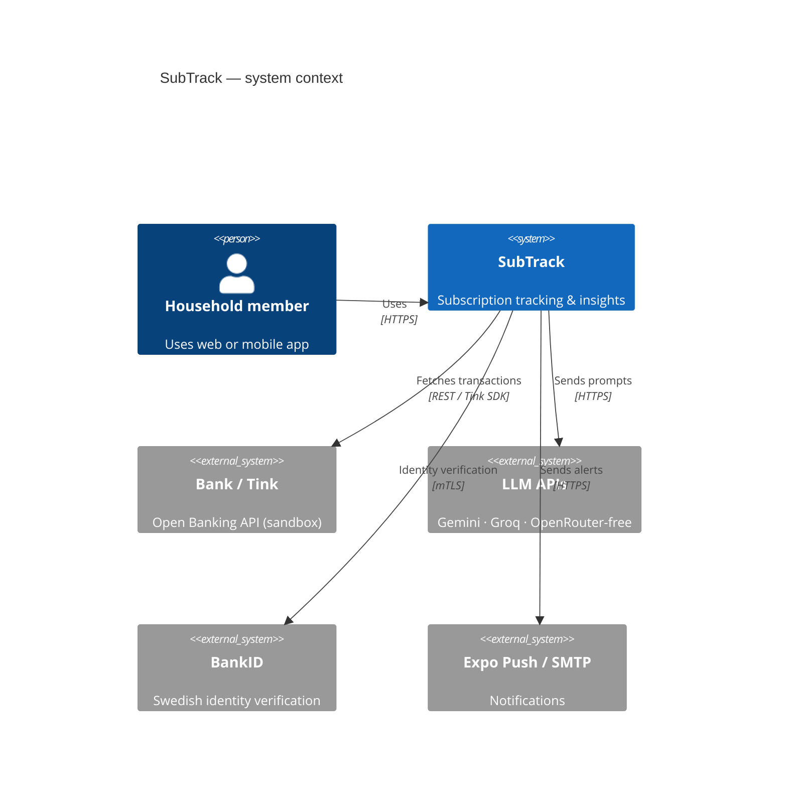
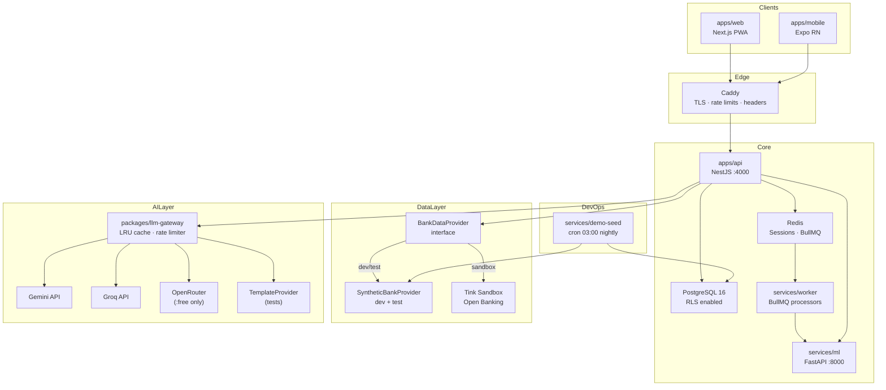
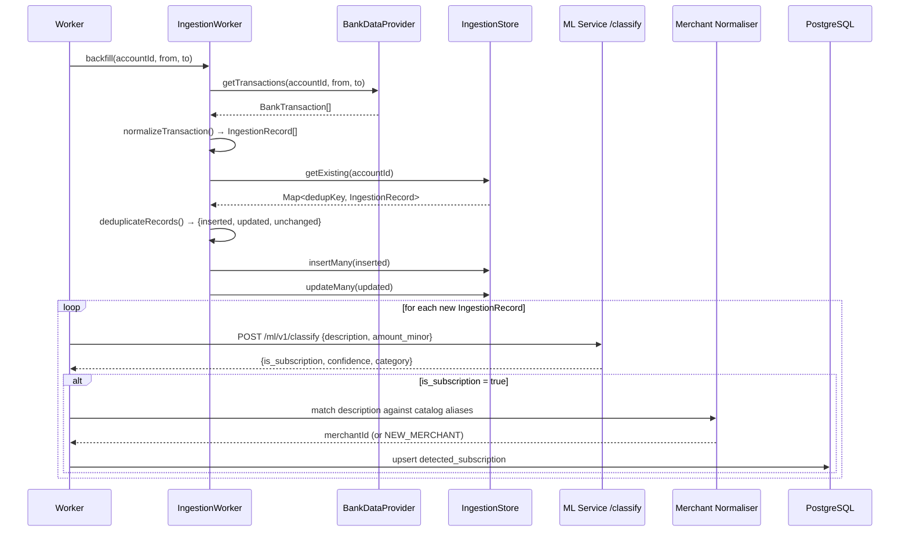
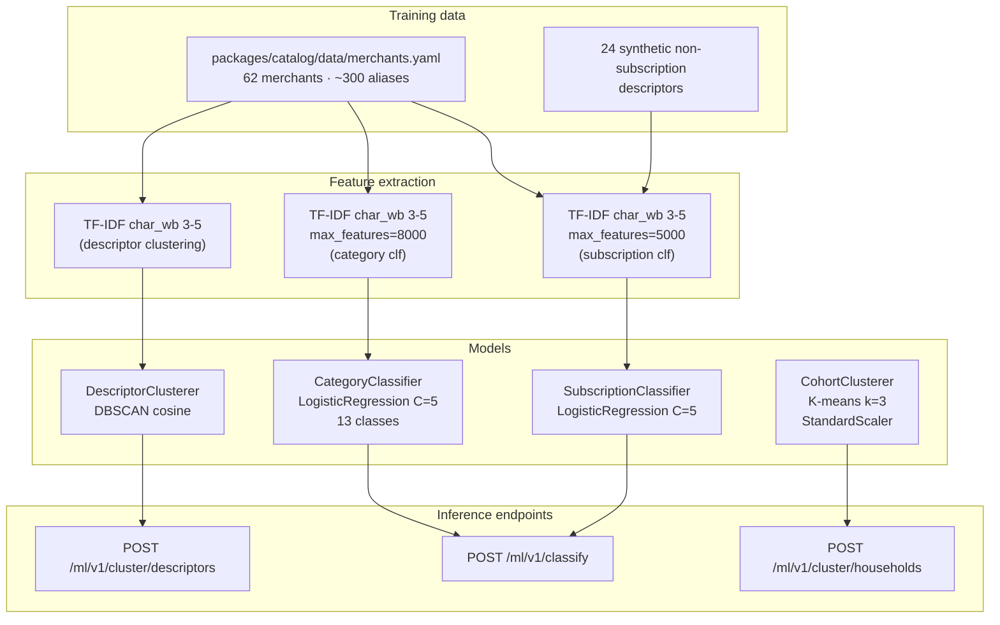
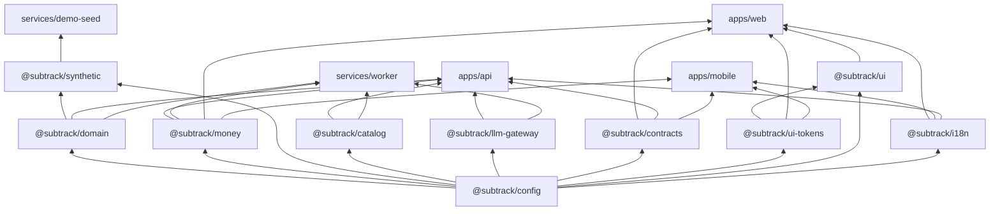
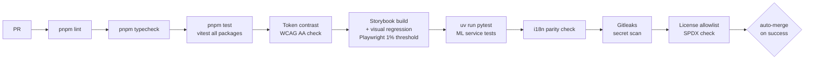

# SubTrack Architecture Overview

A supplement to [`architecture/ARCHITECTURE.md`](architecture/ARCHITECTURE.md) focused on the data flows and AI pipeline that are most relevant for active development.

---

## System diagram





---

## Data flow: bank transaction → subscription detection



---

## LLM Gateway internal flow

```mermaid
flowchart LR
    caller([Application code]) -->|LlmRequest| gw[LlmGateway.complete]

    gw --> cache{Cache hit?}
    cache -->|yes| ret1([return cached\nlatencyMs=0])
    cache -->|no| rl{Rate limit\nOK?}
    rl -->|exceeded| err1([throw RateLimit])
    rl -->|ok| adapter{provider adapter}

    adapter -->|gemini| gem[GeminiProvider\n@google/generative-ai]
    adapter -->|groq| gro[GroqProvider\ngroq-sdk]
    adapter -->|openrouter| or[OpenRouterProvider\nfetch + :free guard]
    adapter -->|template| tpl[TemplateProvider\nstatic response]

    gem & gro & or & tpl --> resp[LlmResponse]
    resp --> write[cache.set]
    write --> ret2([return LlmResponse])
```

---

## ML training + inference pipeline



> **Note:** Training is in-process at FastAPI startup (scikit-learn Pipeline). No model files are written to disk; models are re-trained from the catalog YAML on every service start. For production, add a `joblib.dump/load` step.

---

## Package dependency graph



---

## CI quality gates

Every PR on a `st/*` branch runs the full `subtrack-ci` workflow:



Auto-merge is handled by `.github/workflows/auto-merge.yml` — squash merge with branch delete.
