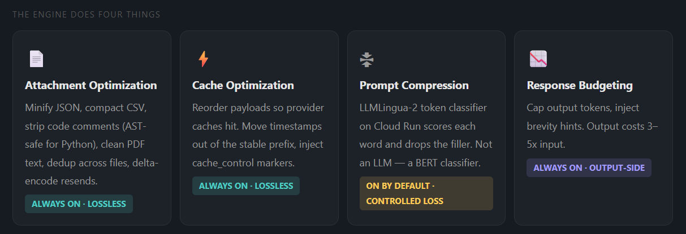
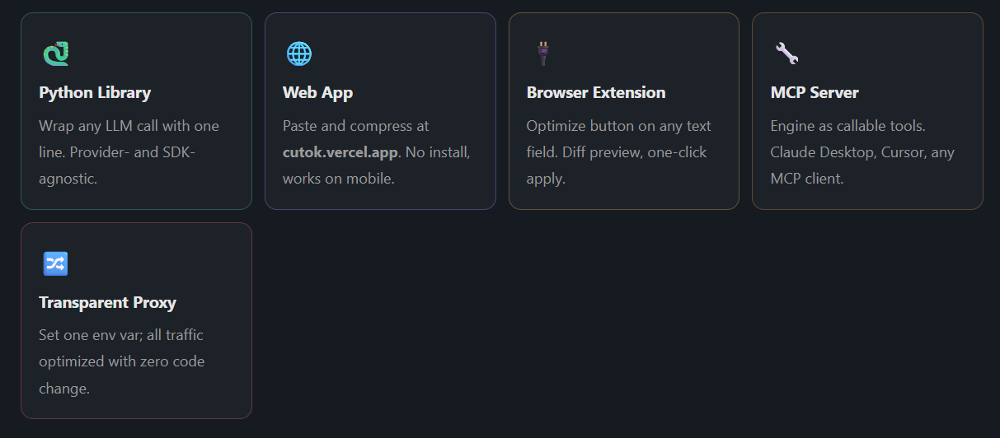
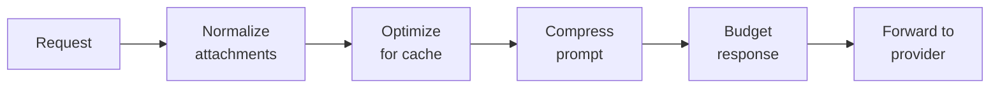
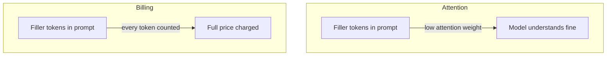
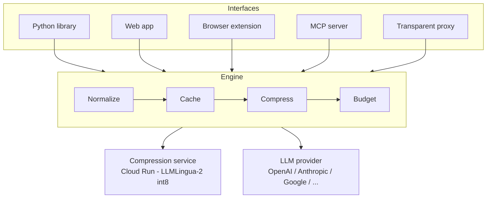
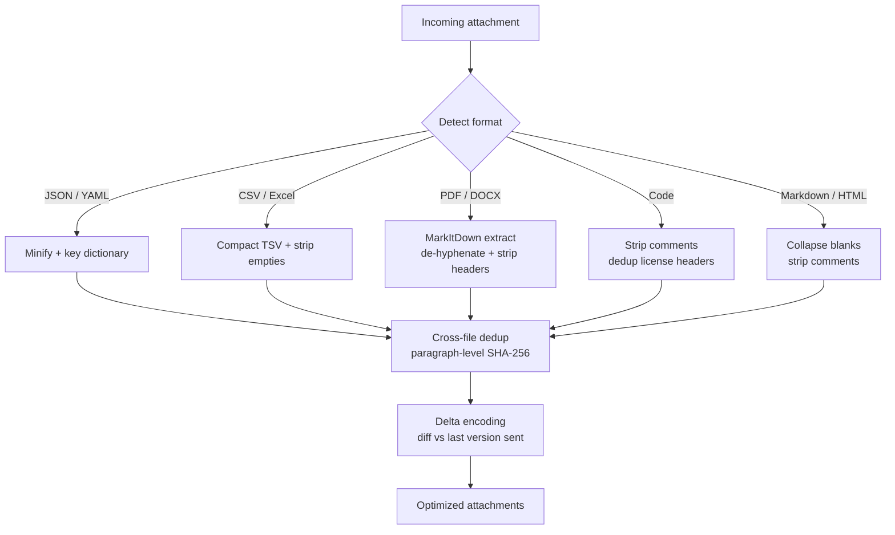
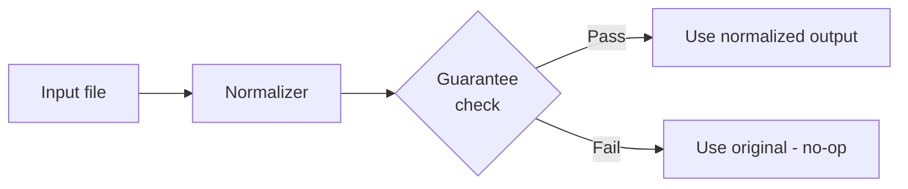

# Cutok

**Cut the token cost of every LLM request - before it's sent.**

Minify attachments, strip code comments, compress prompts, collapse re-sent context, and cap output -
across OpenAI, Anthropic, Google, Mistral, Cohere, DeepSeek, xAI, and any OpenAI-compatible endpoint.

**Live demo for prompt compression → [cutok.vercel.app](https://cutok.vercel.app)**


---

## The core idea

LLMs bill you for every token you send, but most requests are full of waste: pretty-printed JSON that could be half the tokens minified, page headers left behind by PDF extraction, the same 10,000-token context re-sent fifty times in an agent loop, and responses that ramble because nothing asked them not to.

Cutok is one optimization engine that rewrites a request to use fewer tokens without changing its meaning, then gets out of the way. Five interfaces, all backed by the same engine:

| Interface | For | What it does |
|---|---|---|
| **Python library** | Developers | Wrap any LLM/agent call so every request is optimized — provider- and SDK-agnostic. |
| **Web app** | Anyone | Paste a prompt and compress it — no install, works on mobile. |
| **Browser extension** | Web chat users | An **Optimize** button on any editable text field. |
| **MCP server** | Agents / MCP clients | Exposes the engine as callable tools. |
| **Transparent proxy** | Teams / infra | Set one env var; all traffic is optimized with zero code change. |



---

## How it works

Every request passes through four features in sequence:



| Capability | Guarantee | What it does |
|---|---|---|
| **Attachment optimization** | lossless + opt model | Minify JSON/YAML, compact CSV→TSV, extract text from documents (PDF, DOCX, …), strip code comments (Python stays `ast-identical`), and compress prose with the model. |
| **Context dedup & delta** | lossless | Collapse paragraphs repeated across files, and replace re-sent context with a reference on later turns. |
| **Prompt compression** | lossy (controlled) | Compress prose with a hosted LLMLingua-2 model; code blocks and quoted text are never touched. |
| **Cache optimization** | lossless | Reorder payloads for prefix stability and inject `cache_control` markers so provider prompt caches keep hitting. |
| **Response budgeting** | output-side | Inject a provider-correct `max_tokens` cap and an optional brevity directive. |

Compression is **on by default**. Every lossless transform declares a guarantee — `value-identical`,
`text-lossless`, `render-equivalent`, or `ast-identical` — and **reverts to a no-op if it can't prove
it**, so a request is never corrupted.

---

## "But don't LLMs already ignore filler tokens?"

This is the most common question about compression. The answer separates two things that feel the same but aren't:



Internally, the model's attention mechanism *does* down-weight low-relevance tokens. "I was just wondering if you could possibly..." gets almost no attention — the model understands the verbose and terse versions identically. But pricing is purely mechanical: every input token is tokenized, pushed through every transformer layer, and billed at the same rate regardless of how much attention it gets. There is no "this looks like filler, we won't charge you" step.

**Low attention weight ≠ low cost.** Filler tokens hurt in three ways even though the model "ignores" them:

| Impact | Why |
|---|---|
| **Money** | Billed per token, no discount for low relevance |
| **Context window** | They eat into your token budget — matters for long chats and RAG |
| **Latency** | More tokens = more compute; attention scales ~quadratically with length |

And occasionally they cost you **quality** — extra irrelevant text can dilute the important parts ("lost in the middle" effect). So compression is not about helping the model understand — it was fine with the long version. It's about cutting billed tokens, context usage, and latency. This is why it pays off on **long, redundant inputs** (transcripts, pasted docs, RAG context) and barely matters on short prompts.

---

## Architecture



Lossless work runs in-process. Prompt and prose compression are delegated to a single hosted
service — the **same model for every interface** — so results are consistent and the model is
operated in one place. When the service isn't configured, compression is skipped and the rest still
runs; there is no local fallback.

**Compression model.** LLMLingua-2 (Microsoft Research) — a BERT token-classifier that scores each
token's importance and drops the least useful — exported to ONNX and int8-quantized (≈709 MB →
≈178 MB). It runs on Cloud Run, loads the model from object storage at startup, holds no API keys,
and never forwards to an LLM provider.

---

## Attachment normalization in detail

Each file goes through format detection, per-format cleanup, then cross-file optimization:



**Guarantees per format:** JSON/YAML → `value-identical`, CSV → `value-identical`, PDF/DOCX → `text-lossless`, Python code → `ast-identical`, Markdown/HTML → `render-equivalent`.

---

## Safety guarantees

Every lossless transform proves what it guarantees, and reverts to a no-op if it can't:



| Guarantee | What it proves | Used by |
|---|---|---|
| `value-identical` | `json.loads(before) == json.loads(after)` | JSON, YAML, CSV |
| `text-lossless` | All extracted text present; layout artifacts removed | PDF, Word |
| `render-equivalent` | Visible output identical | Markdown, HTML, non-Python code |
| `ast-identical` | `ast.dump(before) == ast.dump(after)` | Python code |

---

## Benchmarks

Real numbers measured on the bundled `scripts/fixtures` (token counts via the OpenAI tokenizer).

**Single file**

| Type | Typical file | Large / redundant file |
|---|---:|---:|
| JSON | 33% | **38%** (key-aliasing activates) |
| Code (Python) | 24% | **48%** (comment-dense) |
| Prose / TXT | 22% | 22% |
| Markdown | 19% | 19% |
| PDF (extract + compress) | 16% | 16% |
| CSV | ~2% | ~2% (tabular data is already dense) |

**Across turns / files** — the largest real-world win for agents and RAG:

| Scenario | Saved |
|---|---:|
| Re-sending the same context on later turns (delta-encoding) | **~99%** |
| Sections repeated across documents (cross-file dedup) | **~49%** |

**Prompt compression** (LLMLingua-2): **−17–19%** at the gentle default, **−34–36%** aggressive.

**Response budgeting** caps the reply, so the saving is whatever the model would have produced beyond
your cap (capping at 256 when it would write 800 ≈ 68% fewer output tokens). Cache savings are
**measured** from each response's real `usage`, never estimated.

---

## Usage

### Python library

```bash
pip install cutok        # or: uv add cutok
```

```python
import cutok as ts

ts.configure(compress_url="https://<service>.run.app")   # enables prompt/prose compression

req = ts.optimize(model="gpt-4o", messages=[...])         # optimize a request
resp = openai.OpenAI().chat.completions.create(**req)

create = ts.optimized(anthropic.Anthropic().messages.create)   # wrap any create-callable
client = ts.wrap(openai.OpenAI())                              # or a whole client
out = ts.optimize_file(open("data.json", "rb").read(), "data.json")  # a single file

print(ts.savings())   # {'tokens_saved': ..., 'by_feature': {...}, 'calls': ...}
```

Optimization is lossless and on by default; pointing it at the compression service additionally
enables prompt and prose compression.

### Web app

Live at **[cutok.vercel.app](https://cutok.vercel.app)**. Paste a prompt to compress it with a
before/after diff — no install, and it works on mobile (where extensions don't). File optimization
lives in the library/MCP.

```bash
cd frontend && npm install && npm run dev
```

### Browser extension

Focus an editable text box on any site; an **⇣ Optimize** button appears, previews a diff, and
applies. Ships with the hosted service as its default (override in options).

```bash
cd extension && npm install && npm run build   # load extension/dist/ unpacked
```

### MCP server

```bash
uv run cutok mcp        # stdio
```

```json
{ "mcpServers": { "cutok": { "command": "uv", "args": ["run", "cutok", "mcp"] } } }
```

Tools: `count_tokens`, `normalize_attachment`, `optimize_for_cache`, `compress_prompt`, `dedupe_context`.

---

## Supported attachment formats

| Type | Formats | Where |
|---|---|---|
| Structured | JSON, YAML, CSV, TSV | library · MCP |
| Text | TXT, Markdown | library · MCP |
| Code | `.py` (AST-safe) + JS/TS, Java, C/C++, Go, Rust, C#, PHP, Ruby, shell, Swift, Kotlin, Scala | library · MCP |
| Documents (text extracted) | PDF, DOCX, PPTX, XLSX, XLS, HTML | library · MCP |

## Supported providers

| Provider | Token counting |
|---|---|
| OpenAI (`gpt-*`, `o*`) | Exact (`tiktoken`) |
| Mistral (`mistral-*`, `mixtral`, `codestral`, …) | Exact (`mistral-common`) |
| Anthropic · Google · Cohere · DeepSeek · xAI | Estimate (flagged non-exact) |
| OpenAI-compatible (Groq, Together, OpenRouter, Ollama, vLLM, LM Studio, …) | Exact with a local tokenizer, else estimate |

Estimates use a real byte-pair tokenizer with a per-provider correction and are never presented as exact.

## Tech stack

| Layer | Choice |
|---|---|
| Engine · proxy · compression service · CLI | Python 3.11+, FastAPI, `uv` |
| Compression model | LLMLingua-2 → ONNX → int8, ONNX Runtime on Cloud Run |
| Web app | Next.js 14, Tailwind, Vercel |
| Extension | TypeScript, Manifest V3, esbuild |
| Token counting | `tiktoken` / `mistral-common` exact; byte-pair proxy elsewhere |
| Document extraction | Microsoft `markitdown` |

## Project layout

```
backend/     Python engine + library + MCP + proxy + compression service (package: cutok)
frontend/    Web app (Next.js, Vercel)
extension/   Browser extension (TypeScript, Manifest V3)
scripts/     Offline benchmark over sample fixtures
```

## Development

```bash
# Python engine
cd backend && uv sync --all-extras && uv run pytest && uv run ruff check cutok tests

# Web app / extension
cd frontend  && npm install && npm run build
cd extension && npm install && npm test && npm run build
```

## Status

A personal portfolio project by Achyuth Kumar Baddela. Not released under an open-source license. All rights reserved. You're welcome to read the code; please get in touch before reusing it.